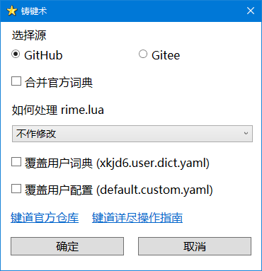

# 星空键道工具

## 铸键术



包含一个主要脚本和两个依赖的动态库，需要放到同一个目录下：

```text
smithing.ps1
git2-e632535.dll
LibGit2Sharp.dll
```

使用时，右键点击 `smithing.ps1` 选择「使用 PowerShell 运行」，或在 PowerShell 命令行直接运行即可。

### 注意

脚本含有非 ASCII 字符，由于 Windows 系统限制，脚本编码必须为 ANSI (GB18030) 或带 BOM 的 UTF-8。

## 开源许可

本仓库使用 [GPL-3.0](https://github.com/amorphobia/jd-tools/blob/master/LICENSE) 或更新版本的许可

### 使用的开源软件或代码

- [Fido](https://github.com/pbatard/Fido) 使用 [GPL-3.0](https://github.com/pbatard/Fido/blob/master/LICENSE.txt) 许可
- [IconForGUI](https://www.powershellgallery.com/packages/IconForGUI/) 使用 [CC BY-SA 4.0](https://creativecommons.org/licenses/by-sa/4.0/) 许可
- [libgit2sharp](https://github.com/libgit2/libgit2sharp) 使用 [MIT](https://github.com/libgit2/libgit2sharp/blob/master/LICENSE.md) 许可
- [libgit2](https://github.com/libgit2/libgit2) 使用[多种](https://github.com/libgit2/libgit2/blob/main/COPYING)许可
